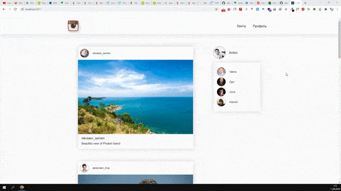

# A simple application to explore the possibilities of using the following technologies:
-  React;
-  Babel.

### Deployment.
- Install Node.js (node -v  [v10.17.0])
- Clone the project and install the necessary dependencies:
```
git clone https://github.com/antonsaf18/react-instagram.git
cd react-instagram
npm i
npm start
```
- Install JSON Server (https://github.com/typicode/json-server):
```
npm install -g json-server
json-server src/posts.json
```
- Install react-router-dom:
```
npm i react-router-dom -save
```

